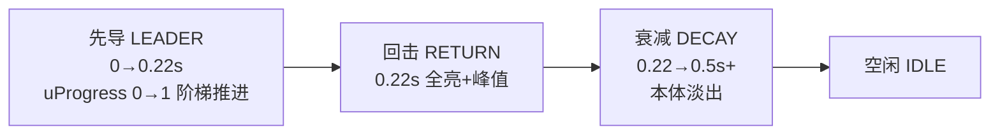
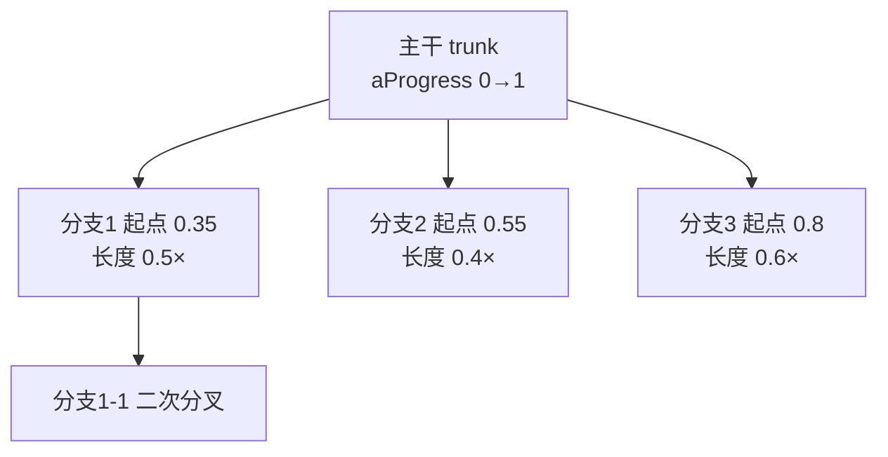

# 最真实闪电方案（plan_lighting）

> 目标：把当前「瞬间整条出现、一次性闪光」的闪电升级为更接近真实的闪电 ——
> **先导逐级向下延伸 + 回击上行闪光 + 多次再击闪烁天空 + 随机分叉**。

---

## 现状与差距

| 维度 | 当前实现 | 真实闪电 |
|---|---|---|
| 出现方式 | 整条瞬间出现 | 阶梯先导**逐级向下延伸**（约 0.1~0.25s） |
| 天空闪光 | 单次双闪 | **多次再击**（3~5 次），云层内部翻涌闪烁 |
| 分支 | 主干随机分支 1 层 | 主干 + 1~2 级递归分叉，长度/角度随机 |
| 亮度曲线 | 指数衰减 | attack 极快（<10ms 到峰值）+ 多次脉冲衰减 |

---

## 真实闪电的关键特征

1. **阶梯先导（stepped leader）**：从云层向下以约 50m/级的步进延伸，
   路径随机转折（锯齿），视觉上呈「逐级生长」。
2. **回击（return stroke）**：先导触地后，回程通道瞬间被强烈点亮，
   是最亮的一帧，随后指数衰减。
3. **多次再击（multiple strokes）**：同一通道通常 3~5 次再击，
   间隔 30~100ms、强度逐次递减 → 天空「闪烁」。
4. **随机分叉（branches）**：先导路径随机分叉出多条支路，长短/方向各异。

---

## 1. 动画式出现（顶部 → 底部）

### 思路
- 闪电整条几何体**一次性生成**（保证路径随机稳定），但给每个顶点标记
  **沿路径的进度 `aProgress`（0→1）**；
- 用一个 **`uProgress` uniform**（0→1）逐级揭示：只有 `aProgress ≤ uProgress` 的段可见；
- 揭示边缘带软过渡（smoothstep），避免硬切。

### 材质（TSL 节点材质，适配 three/webgpu）
```js
// MeshBasicNodeMaterial + fragmentNode
const vProgress = attribute('progress')          // 每顶点 0~1
const reveal = smoothstep(uProgress.sub(0.06), uProgress, vProgress)
col.mulAssign(reveal)                             // 逐级点亮
```

### 时序（一次闪电约 0.5~0.6s）

- **先导阶段**：`uProgress` 用「逐段跳跃」而非线性，模拟 stepped leader
  （如每 25ms 推进 2~3 段），顶部先亮、逐级向下。
- **回击瞬间**：`uProgress=1` 全亮，同时触发天空闪光峰值。
- 分支与主干共享 `uProgress`：分支起点带各自偏移的 `aProgress`，先导到该处才点亮。

---

## 2. 天空闪烁

### 思路
- 天空/云层整体亮度（复用现有 `uLightning` uniform）+ 云层内部局部辉光；
- **多次再击**产生「闪烁」：主击后 3~5 次再击，间隔 30~100ms、强度递减。

### 多次再击包络（示例）
```
主击: 1.00
  └─ 60ms → 0.70
  └─ 90ms → 0.50
  └─ 70ms → 0.35
  └─ 80ms → 0.20   → 结束
```
- 每次再击：attack 极快（<10ms 到该次峰值）、decay 指数下降；
- 整体包络：`uLightning = base * Σ stroke_i(t)`，只点亮天空不长时间白屏。

### 云层内部翻涌
- 云层/天空材质中，用 `uLightning × noise(uv×freq + t)` 调制漫反射亮度，
  模拟云被照亮后的「内部翻涌」；闪烁频率约 10~20Hz，持续 0.4~0.6s。

---

## 3. 分支

### 思路
- **递归分叉**：主干生成后，在随机节点递归长出 1~2 级子分支：
  - 每级 0~3 支；
  - 分支长度 = 父级当前段长的 40%~60%；
  - 方向偏角 ±20°~50°，可带二次分叉（概率低）。
- 分支与主干共用同一条 `uProgress` 揭示曲线（各自记录起始 `aProgress`）。

### 生成示意


---

## 阶段状态机（update 主循环）

```js
let phase = 'idle'        // idle → leader → return → decay
let phaseT = 0            // 当前阶段已用时间
let progress = 0          // uProgress 0~1
let strokeQueue = []      // 再击时间表（ms, strength）

function update(dt) {
  switch (phase) {
    case 'leader':
      phaseT += dt
      // 阶梯式推进（每 LEADER_STEP_TIME 推 LEADER_STEP_SEG 段）
      progress = min(1, progress + stepDelta(dt))
      uProgress.value = progress
      if (progress >= 1) { phase = 'return'; phaseT = 0 }
      break
    case 'return':        // 回击：全亮 + 触发天空闪光与再击队列
      phase = 'decay'; phaseT = 0
      flashPeak(); scheduleStrokes()
      break
    case 'decay':         // 本体淡出 + 依次触发再击
      phaseT += dt
      boltOpacity -= dt * BOLT_DECAY
      fireScheduledStrokes(phaseT)   // 到时间就点一次 uLightning
      if (boltOpacity <= 0 && allStrokesDone) { phase = 'idle'; hide() }
      break
  }
}
```

---

## 参数微调表（放顶部微调区，全部带备注）

| 参数 | 含义 | 建议默认 |
|---|---|---|
| `LEADER_STEP_TIME` | 先导每级步进时间（ms） | 25 |
| `LEADER_STEP_SEG` | 每步推进的段数 | 2~3 |
| `RETURN_ATTACK` | 回击峰值上升时间（ms） | 8 |
| `STROKE_COUNT` | 再击次数 | 3~4 |
| `STROKE_INTERVAL_MIN/MAX` | 再击间隔（ms） | 60 / 120 |
| `STROKE_DECAY` | 再击强度衰减系数 | 0.72 |
| `SKY_FLICKER_AMP` | 云层噪声闪烁强度（0~1） | 0.5 |
| `BRANCH_LEVELS` | 分支级数 | 2 |
| `BRANCH_MAX_PER` | 每级最大分支数 | 3 |
| `BRANCH_LEN_MIN/MAX` | 分支长度占父级比例 | 0.4 / 0.6 |
| `BRANCH_ANGLE` | 分支偏角（°） | ±20~50 |
| `BOLT_WIDTH` | 闪电带宽（三角带） | 2.5 |
| `FLASH_DECAY` | 本体衰减（保留久一点） | 1.6 |

---

## 实现要点（代码路径）

- **`lightning.ts`**
  1. 几何生成改为「主干 + 递归分支」并写入 per-vertex `progress` attribute；
  2. 材质从 `MeshBasicMaterial` 换为 `MeshBasicNodeMaterial`（TSL），
     片元用 `uProgress` + `aProgress` 逐级揭示；
  3. `update()` 改为阶段机（leader / return / decay / idle）；
  4. 天空闪光用「多次再击包络」驱动 `uLightning`，不再单次双闪。
- **`weather-system.ts` / `OpenSea.vue`**
  - 不变：`triggerLightning()`（L 键）与自动触发照旧接入。

---

## 备注（可选增强）

- **雷声延迟**：按闪电距离延迟 1~3s 播放雷声（音效，可选）。
- **海面反光**：闪电瞬间海面 specular 高光一闪（复用 `uLightning`）。
- **云层体积感**：若需要更真实，可在云层顶部加一次半球形辉光（闪电出处）。
